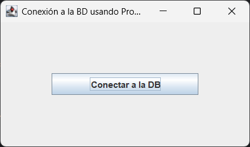
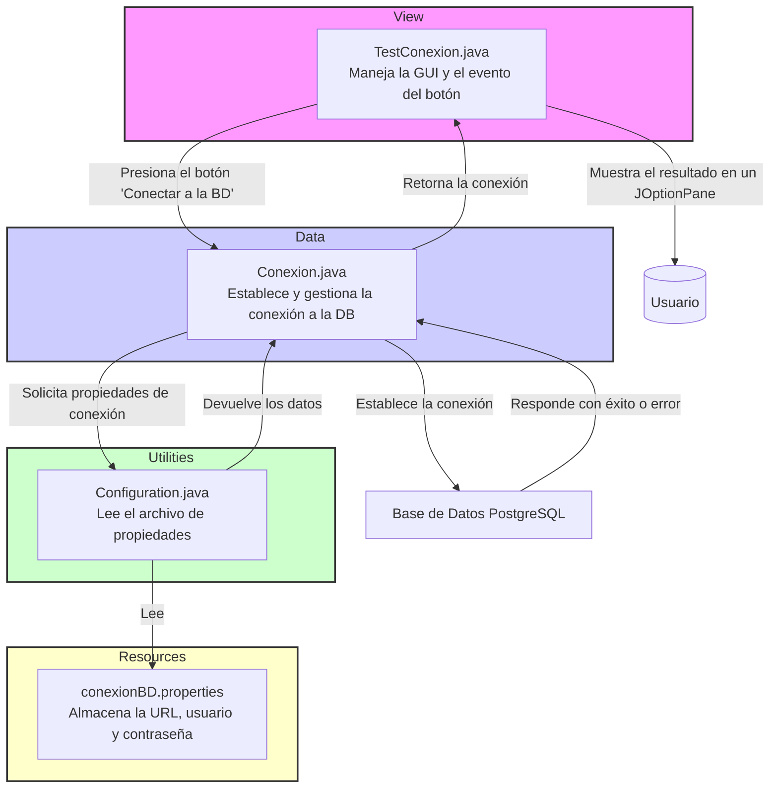

# 📖 GUÍA RÁPIDA DEL PROYECTO: CONEXIÓN JDBC CON ARCHIVO PROPERTIES EN JAVA Y POSTGRESQL📦
Este proyecto es una aplicación de escritorio simple construida con **Java Swing** y **JDBC** que demuestra el uso de un archivo 
de propiedades para gestionar los detalles de la conexión a una base de datos **PostgreSQL.** La aplicación permite probar 
la conexión de manera segura, garantizando la separación de la configuración y la lógica de la aplicación.

_Autor: Saul Echeverri_   
_Edición: 2025_



## Comenzando 🚀
Este proyecto es una aplicación **Java Swing** para posibilitar la persistencia en base de datos PostgreSQL desde un 
archivo properties.

Diseñado con fines educativos para practicar **GUI con Java**, conexión con bases de datos mediante **JDBC** con
mediante un archivo **properties** y estructura básica de proyectos en IntelliJ IDEA.

Se basa en el curso de **Java y MySQL** de **La Tecnologia Avanza de Cristian** publicado en
la plataforma de Youtube

Este repositorio es de carácter **Educativo** con fines de estudio sobre la iniciación del lenguaje **java** y aprendizaje 
de la **integración con bases de datos con SQL**.

---
## 1. REQUISITOS DEL SISTEMA ⚙️
Para ejecutar este proyecto, necesitas tener instalados los siguientes componentes:

### Instalación 🔧

A continuación, se describen los pasos para configurar y ejecutar este proyecto Java en tu entorno de desarrollo.

#### Requisitos Previos
Antes de comenzar, asegúrate de tener los siguientes requisitos previos en tu sistema:

- **IntelliJ IDEA** (u otro IDE compatible con Java)
- **Conexión a Internet** para descargar dependencias vía Maven
- **Java Development Kit (JDK):** Debes tener instalado Java Development Kit (JDK) en tu sistema. Este proyecto requiere
  JDK 17 o una versión superior. Puedes descargar y configurar JDK desde el sitio oficial de [Oracle](https://www.oracle.com/java/technologies/javase-downloads.html) o [OpenJDK](https://adoptopenjdk.net/).
- **Maven**: Gestor de dependencias que se utilizó para administrar las bibliotecas y las dependencias del proyecto.
    Puedes encontrar más información sobre Maven en [https://maven.apache.org/](https://maven.apache.org/).


  Para verificar si Java está instalado, puedes abrir una terminal y ejecutar el siguiente comando:

   ```shell
   java -version
   ```

- **PostgreSQL**: Asegúrate de tener PostgreSQL instalado en tu sistema. Puedes obtener más información en su [sitio oficial](https://www.postgresql.org/download/).
- **Driver JDBC para PostgreSQL**: La dependencia necesaria para que la aplicación Java se conecte a la base de datos.
  Si usas Maven, asegúrate de tener la siguiente dependencia en tu pom.xml:

    ```xml
    <dependency>
        <groupId>org.postgresql</groupId>
        <artifactId>postgresql</artifactId>
        <version>42.5.4</version>
    </dependency>
    ```
- **Git**: instalalo en su sitio oficial [Git](https://git-scm.com/) si deseas clonar el repositorio.


#### Clonar el Repositorio

Para comenzar, clona este repositorio en tu máquina local usando Git:

```shell
git clone https://github.com/saulolo/java-postgresql-properties-connection.git
```

## Despliegue 📦

En esta sección, se proporcionan instrucciones y notas adicionales sobre cómo llevar tu proyecto a un entorno de
producción o cómo desplegarlo para su uso.

### Despliegue Local 🏠

Si deseas ejecutar tu proyecto en tu propio entorno local para pruebas o desarrollo, sigue estos pasos generales:

1. **Configura PostgreSQLs**: Asegúrate de tener una base de datos PostgreSQL funcionando. Crea una base de datos con
   el nombre `bd_person_la_tec_avanz` con una tabla `registros(id integer, usuario varchar, contrasena varchar)`

2. **Verificar**: que el archivo `Conexion.java` tiene la URL correcta: `bd_person_la_tec_avanz`.
```java
jdbc:postgresql://localhost:5432/bd_person_la_tec_avanz
```
3. **Configuración de Variables de Entorno**: Asegúrate de que tu sistema tenga configuradas las variables de entorno JAVA_HOME y PATH para que apunten a
   tu instalación de JDK.

4. **Compilación y Ejecución**: Para compilar y ejecutar el proyecto localmente usando Maven ejecuta el siguiente comando:
```shell
mvn clean install
```
5. **Ejecución**: Ejecutar la clase `Main.java` que lanza la ventana con la interfaz gráfica del boton de **conexión a la BD**.

El proyecto se ejecutará en tu servidor local en http://localhost:8080.

### 🧩 Script SQL para la Base de Datos

- Este proyecto incluye un archivo SQL que crea la base de datos y la tabla necesarias para el registro de usuarios.
- Tambien incluye un archivo con queries de interes.

📄 **Archivos incluido:**  
- `src/main/resources/db_sql/bd_person_la_tec_avanz.sql`
- `src/main/resources/db_sql/queries.sql`

🔧 **¿Qué hace este script?**

- Crea la base de datos `bd_person_la_tec_avanz` si no existe.
- Crea la tabla `registros` con los campos:
    - `id` (entero, clave primaria)
    - `usuario` (cadena única)
    - `contrasena` (cadena únicas)
- Añade una restricción `UNIQUE` al campo `usuario` para evitar duplicados.

📌 **Instrucciones para ejecutarlo desde DBeaver (PostgreSQL):**

1. Abre DBeaver y conéctate a tu servidor de PostgreSQL.
2. Si no existe la base de datos `bd_person_la_tec_avanz`, créala:
- Haz clic derecho sobre el servidor > **Create > Database**
- Nómbrala: `bd_person_la_tec_avanz`

3. Haz clic derecho sobre la nueva base de datos > **SQL Editor > Open SQL Script**

4. Copia y pega el contenido del archivo `bd_person_la_tec_avanz.sql` o ábrelo desde el explorador con `File > Open File`.

5. Ejecuta el script completo haciendo clic en el botón ▶️ o presionando `Ctrl + Enter`.

📝 **Ejemplo del contenido del archivo `.sql`:**

```sql
-- Crear tabla 'registros'
CREATE TABLE IF NOT EXISTS registros (
    id SERIAL PRIMARY KEY,
    usuario VARCHAR(50) UNIQUE NOT NULL,
    contrasena VARCHAR(50) NOT NULL
);
```

---
## 2. ESTRUCTURA DEL PROYECTO 🏗️
El proyecto sigue una arquitectura Model-View-Controller (MVC) básica para organizar las responsabilidades de cada clase, 
lo que facilita el mantenimiento y la escalabilidad.

```ja
java-postgresql-properties-connection/
├── src/
│   └── main/
│       └── java/
│           └── org.educatiom/
│               ├── data/
│               │   └──  Conexion.java
│               ├── util/
│               │   └── Configuration.java
│               ├── view/
│               │   ├── TestConexion.java
│               │   └── TestConexion.form
│               └── Main.java
└── resources/
    ├── db_sql/
    │    ├── bd_person_la_tec_avanz.sql
    │    └── queries.sql
    └── conexionBD.properties
```

- `org.educatiom.main`: 
    -   `org.educatiom.main`: El punto de entrada de la aplicación. Es responsable de iniciar la interfaz de usuario en 
  el hilo de Swing.
  
-   `data:`
    -  `Conexion.java`: La capa de acceso a datos. Utiliza el patrón Singleton para asegurar una única instancia de 
    conexión a la base de datos.
- `org.educatiom.util`:
    -  `Configuration.java`: La clase de utilidad que lee los datos de conexión desde el archivo de propiedades de manera 
  segura y portable.
- `org.educatiom.view`:
    -  `TestConexion.java`: La capa de la vista. Contiene la interfaz de usuario Java Swing y maneja los eventos del 
  botón, mostrando el resultado de la conexión.
- `resources`:
    -  `conexionBD.properties`: Archivo de configuración que almacena la URL de la base de datos, el usuario y la contraseña.

---
## 3. PROPERTIES FILES 🗃️
Un archivo de propiedades (o de configuración: **properties**) es un archivo de texto simple que almacena datos en un 
formato de **clave-valor**. Su uso es una práctica recomendada en el desarrollo de software por varias razones clave:

### Beneficios Clave ✅
- **Seguridad y Mantenimiento**: Permite externalizar la configuración del código fuente. Los datos sensibles como las 
credenciales de la base de datos no se codifican directamente en el programa. Esto facilita su actualización sin necesidad 
de recompilar el código.
- **Portabilidad**: Al usar `ClassLoader` para leer el archivo desde el `classpath` del proyecto, la aplicación puede 
ejecutarse en diferentes entornos sin modificar las rutas del archivo.

- **Flexibilidad**: Facilita la adaptación de la aplicación a distintos entornos (desarrollo, pruebas, producción) simplemente modificando las propiedades del archivo.

### Flujo de la Aplicación para la Conexión a la Base de Datos 📊


En este proyecto, la clase `Configuration` lee el archivo `conexionBD.properties`. La clase `Conexion` utiliza estos datos 
para establecer la conexión a la base de datos. Este enfoque mantiene la lógica de conexión y la configuración separadas, 
lo cual es un ejemplo práctico del patrón de separación de responsabilidades.

### Resumen del Flujo:
`TestConexion` ➡️ `Conexion` ➡️ `Configuration` ➡️ `conexionBD.properties` ➡️ `Conexion` ➡️ `PostgreSQL`

### Métodos y Clases Principales de la API de Java en el Proyecto.

| Clase                             | Principales Métodos                                               | Descripción                                                                                   |
|:----------------------------------|:------------------------------------------------------------------|:----------------------------------------------------------------------------------------------|
| **java.sql.Connection**           | `getConnection()`                                                 | Establece el canal de comunicación con la base de datos.                                      |
| **java.util.Properties**          | `load(inputStream)`                                               | Carga datos del archivo de configuración.                                                     |
|                                   | `getProperty(key)`                                                | Lee datos del archivo de configuración.                                                       |
| **java.io.InputStream**           | `FileInputStream(path)`                                           | Lee el archivo de propiedades como un flujo de bytes                                          |
| **java.sql.DriverManager**        | `getConnection(url, user, password)`                              | Un gestor de drivers que crea la conexión a la base de datos.                                 |
| **javax.swing.JFrame**            | `setTitle(String)`                                                | Establece el título que aparecerá en la barra superior de la ventana de la aplicación.        |
|                                   | `add(Component)`                                                  | Agrega un componente (como un `JPanel` o un `JButton`) a la ventana.                          |
|                                   | `pack()`                                                          | Redimensiona la ventana para que se ajuste a los tamaños preferidos de todos sus componentes. |
|                                   | `setVisible(boolean)`                                             | Hace que la ventana de la aplicación sea visible u oculta.                                    |
| **javax.swing.JButton**           | `addActionListener(ActionListener)`                               | Representa el botón; su método principal maneja los clics.                                    |
| **javax.swing.JOptionPane**       | `showMessageDialog(parentComponent, message, title, messageType)` | Muestra cuadros de diálogo al usuario                                                         |
| **java.awt.event.ActionListener** | `actionPerformed(ActionEvent`                                     | Define la acción a ejecutar cuando ocurre un evento.                                          |


---
## 4. CONTRIBUYENDO 🖇️

¡Gracias por tu interés en contribuir a este proyecto! Aquí hay algunas reglas y pautas para enviar contribuciones:

### Reglas para Enviar Solicitudes de Extracción (Pull Requests) 🔀

1. Antes de enviar una solicitud de extracción, asegúrate de que tu código esté bien probado y sea compatible con la
   rama principal.

2. Sigue un estilo de código consistente.

3. Si tu contribución agrega nuevas características, proporciona documentación clara sobre cómo utilizar esas
   características.

### Informar Problemas 🐞

Si encuentras errores o problemas en el proyecto, por favor, abre un issue para informarnos. Proporciona detalles claros
sobre el problema, incluyendo pasos para reproducirlo.

### Comunicación 💬

Me encanta escuchar tus ideas y responder tus preguntas. Siempre puedes [contactarme](https://www.linkedin.com/in/saul-echeverri-duque/) para discutir el proyecto o plantear cualquier pregunta que tengas.

¡Espero que te unas a nuestra comunidad de contribuyentes y espero tus valiosas contribuciones!

### ¿Dónde obtener ayuda? 🆘

Si tienes preguntas o necesitas ayuda durante el proceso de contribución, no dudes en [contactarme](https://www.linkedin.com/in/saul-echeverri-duque/) o abrir un issue para obtener asistencia.

¡Espero trabajar contigo en este proyecto y agradecemos tu ayuda o sugerencias para mejorarlo!


## Autor ✒️

¡Hola! Soy **Saul Echeverri Duque** 👨‍💻 , el creador y desarrollador de este proyecto. Permíteme compartir un poco sobre mi
formación y experiencia:

### Formación Académica 📚

- 🎓 Graduado en Ingeniería de Alimentos por la Universidad de Antioquia, Colombia.
- 📖 Titulado en Tecnología en Análisis y Desarrollo de Software por el SENA.

### Trayectoria Profesional 💼

- 👨‍💻 Cuento con más de tres años de experiencia laboral en el campo del desarrollo de software.
- 🌟 Durante mi trayectoria, he tenido el privilegio de trabajar en diversos proyectos tecnológicos, donde he aplicado
  mis conocimientos en programación y análisis.
- 🏢 Actualmente, formo parte de [IAS Software](https://www.ias.com.co/), una empresa de software en Medellín, Colombia,
  donde sigo creciendo profesionalmente y contribuyendo al mundo de la tecnología.

### Pasión por la Programación 🚀

- 💻 Mi viaje en el mundo de la programación comenzó en el 2021, y desde entonces, he estado inmerso en el emocionante
  universo del desarrollo de software.
- 📚 Uno de mis mayores intereses y áreas de enfoque es **Java**, y este proyecto es el resultado de mi deseo de compartir
  conocimientos y experiencias relacionadas con este lenguaje.
- 🤝 Estoy emocionado de colaborar y aprender junto a otros entusiastas de Java.

Estoy agradecido por la oportunidad de compartir este proyecto contigo y espero que te sea útil en tu propio camino de
aprendizaje y desarrollo. Si tienes alguna pregunta, sugerencia o simplemente quieres charlar sobre tecnología, no dudes
en ponerte en contacto conmigo. ¡Disfruta explorando el mundo de Java!

¡Gracias por ser parte de este proyecto! 😊


## Licencia 📄

Este proyecto se basa en el curso "Java y MySQL de La Tecnologia Avanza" de Cristian y se
desarrolla con fines educativos y de aprendizaje del lenguaje de Java. La utilización de los
ejercicios y contenido del proyecto se realiza en concordancia con los derechos de uso permitidos por el autor y su curso.

**Nota Importante**: Este proyecto no se distribuye bajo una licencia de código abierto estándar, ya que está destinado
principalmente para fines personales y educativos. Si deseas utilizar o distribuir el contenido de este proyecto más
allá de los fines educativos personales, asegúrate de obtener los permisos necesarios del autor.

Es importante respetar los derechos de autor y las restricciones legales asociadas con el contenido del cuerso en el que
se basa este proyecto.


## Expresiones de Gratitud 🎁

Quiero expresar mi más sincero agradecimiento a [Cristian](https://www.youtube.com/@latecnologiaavanza/videos),
propietario del canal "La Tecnologia Avanza", cuya obra ha sido la fuente de inspiración  y aprendizaje fundamental para
este proyecto. Su dedicación a la enseñanza y la claridad de su canal han sido invaluables para mí durante la creación
de este proyecto.

Si encuentras este proyecto útil y te gustaría expresar tu gratitud de alguna manera, aquí hay algunas opciones:

* Comenta a otros sobre este proyecto 📢: Comparte este proyecto con tus amigos, colegas o en tus redes sociales para
  que otros también puedan beneficiarse de él.

* Invita una cerveza 🍺 o un café ☕ a alguien del equipo: Siéntete libre de mostrar tu aprecio por el esfuerzo del
  autor o del único miembro del equipo (yo) comprándoles una bebida virtual.

* Da las gracias públicamente 🤓: Puedes expresar tu agradecimiento públicamente en el repositorio del proyecto, en los
  comentarios, o incluso en tu blog personal si lo deseas.

* **Dona a través de una cuenta bancaria** 💰: Si prefieres hacer una donación en efectivo o mediante transferencia
  bancaria, puedes hacerlo a la siguiente cuenta de ahorros en Bancolombia: 230-1588-1151. Tu generosidad será muy
  apreciada y contribuirá al mantenimiento y mejora de este proyecto.

¡Gracias por ser parte de este viaje de aprendizaje y desarrollo!


## Créditos 📜

Este proyecto fue desarrollado con ❤️ por [Saul Echeverri](https://github.com/saulolo) 😊.

Si tienes preguntas, comentarios o sugerencias, no dudes en ponerte en contacto conmigo:

- GitHub: [https://github.com/saulolo](https://github.com/saulolo) 🌐
- Correo Electrónico: [saulolo@gmail.com](saulolo@gmail.com) 📧
- LinkedIn: [https://www.linkedin.com/in/saul-echeverri-duque/](https://www.linkedin.com/in/saul-echeverri-duque/) 💼

---
### METADATOS DEL DOCUMENTO 📄


| Campo                    | Detalles                                                                                     |
|:-------------------------|:---------------------------------------------------------------------------------------------|
| **Título**               | GUÍA RÁPIDA DEL PROYECTO: CONEXIÓN JDBC CON ARCHIVO PROPERTIES EN JAVA Y POSTGRESQL          |
| **Autor(es)**            | Saul Echeverri                                                                               |
| **Versión**              | 1.0.0                                                                                        |
| **Fecha de Creación**    | 07 de Septiembe de 2025                                                                      |
| **Última Actualización** | 07 de Septiembe de 2025                                                                      |
| **Notas Adicionales**    | Documento base para referencia rápida de la conexión a una BD usando un archivo porperties.  |

---

